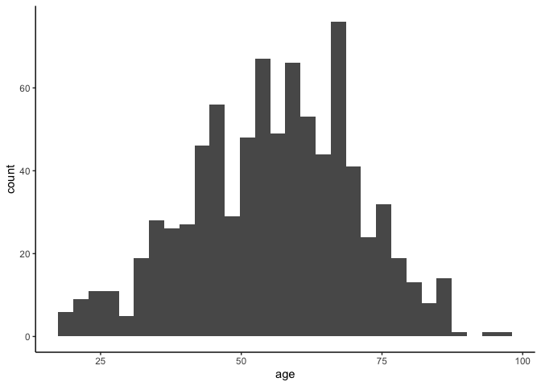
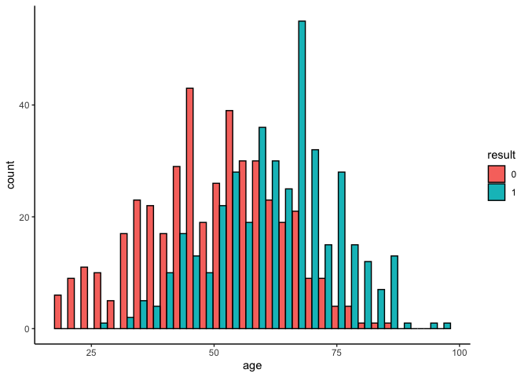
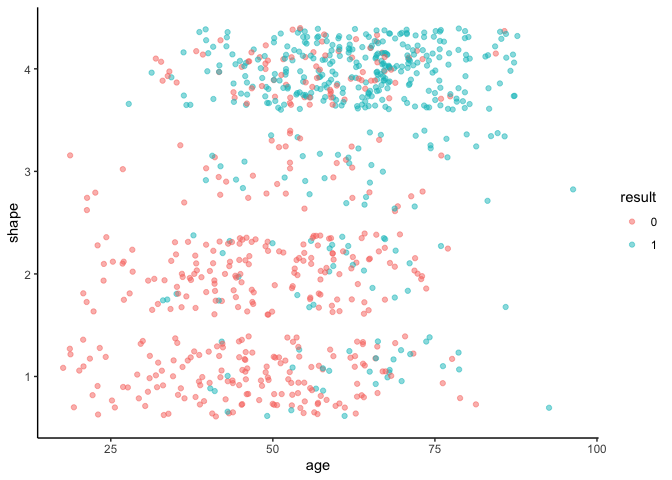
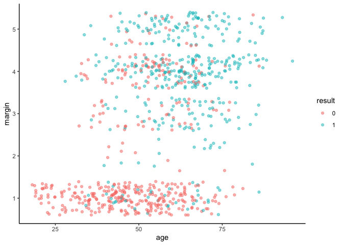

Mammographic Masses Neural Network
================
Rex Manglicmot
2023-01-01

-   <a href="#continuing-working-document"
    id="toc-continuing-working-document">Continuing Working Document</a>
-   <a href="#introduction" id="toc-introduction">Introduction</a>
-   <a href="#loading-the-libraries" id="toc-loading-the-libraries">Loading
    the Libraries</a>
-   <a href="#loading-the-data" id="toc-loading-the-data">Loading the
    Data</a>
-   <a href="#cleaning-the-data" id="toc-cleaning-the-data">Cleaning the
    Data</a>
-   <a href="#exploratory-data-analysis"
    id="toc-exploratory-data-analysis">Exploratory Data Analysis</a>
-   <a href="#neural-networks" id="toc-neural-networks">Neural Networks</a>
-   <a href="#limitations" id="toc-limitations">Limitations</a>
-   <a href="#conclusion" id="toc-conclusion">Conclusion</a>
-   <a href="#inspiration-for-this-project"
    id="toc-inspiration-for-this-project">Inspiration for this project</a>

## Continuing Working Document

## Introduction

## Loading the Libraries

``` r
library(tidyverse)
library(viridis)
library(neuralnet)
```

## Loading the Data

``` r
#get data from UCI website
url <- 'https://archive.ics.uci.edu/ml/machine-learning-databases/mammographic-masses/mammographic_masses.data'

#load data into object
data_orig <- read.csv(url)
```

## Cleaning the Data

``` r
# look at data
str(data_orig)
```

    ## 'data.frame':    960 obs. of  6 variables:
    ##  $ X5  : chr  "4" "5" "4" "5" ...
    ##  $ X67 : chr  "43" "58" "28" "74" ...
    ##  $ X3  : chr  "1" "4" "1" "1" ...
    ##  $ X5.1: chr  "1" "5" "1" "5" ...
    ##  $ X3.1: chr  "?" "3" "3" "?" ...
    ##  $ X1  : int  1 1 0 1 0 0 0 1 1 1 ...

It would seem that the data is messy.

On the UCI website it listed that the there are a total of 961
observatins but we have only 960. Therefore, the column name would
appear to be an observation. However, upo further inspection, the “X5.1”
and “X3.1” column does not make any sense because values should be based
on 1-5 and 1-4, respectively. I will therefore delete that observation
from the dataset and relabel the columns.

But first, I will make a copy of the original dataset for manipulation.

``` r
#make a copy
data <- data_orig

#change column names
colnames(data) <- c('BIRAD', 'age', 'shape', 'margin', 'density', 'result')

#get rid of BIRAD since on the UCI website it is non-predictive
data <- subset(data, select = -(BIRAD))

#How many NA do we have?
sum(is.na(data))
```

    ## [1] 0

``` r
#how many columns have ?
sum(data == '?')
```

    ## [1] 160

``` r
# which specific observations have '?'
which(data == '?')
```

    ##   [1]  443  453  683  884  923  966  969  980 1008 1014 1034 1043 1088 1117 1123
    ##  [16] 1196 1215 1347 1348 1349 1354 1436 1456 1479 1491 1497 1514 1521 1541 1574
    ##  [31] 1620 1621 1622 1712 1738 1784 1925 1926 1927 1932 1939 1940 1942 1947 1955
    ##  [46] 1968 1979 2004 2005 2007 2014 2020 2021 2023 2053 2067 2076 2077 2079 2107
    ##  [61] 2147 2198 2218 2225 2235 2279 2291 2292 2307 2314 2372 2379 2396 2439 2440
    ##  [76] 2441 2451 2461 2494 2582 2611 2643 2665 2739 2881 2884 2899 2902 2906 2915
    ##  [91] 2918 2920 2923 2925 2927 2932 2933 2935 2937 2938 2939 2943 2945 2947 2954
    ## [106] 2964 2965 2967 2968 2972 2976 2977 2980 2981 2982 2983 2984 2985 2986 2987
    ## [121] 2989 2993 2994 2996 3001 3006 3007 3008 3013 3022 3024 3036 3038 3051 3056
    ## [136] 3064 3089 3092 3098 3142 3157 3165 3185 3219 3231 3251 3252 3255 3301 3340
    ## [151] 3344 3374 3381 3449 3454 3494 3507 3545 3557 3632

``` r
# which specific observations have '*'
sum(data == '*')
```

    ## [1] 0

``` r
#Replace ? with NAs
data[data == '?'] <- NA

#sum the NAs again
sum(is.na(data))
```

    ## [1] 160

``` r
#remove the NA observations
data <- na.omit(data)

#dimensions of the dataset
dim(data)
```

    ## [1] 830   5

Let’s change the class

``` r
#convert age column into a numeric
data$age <- as.numeric(as.character(data$age))

#create a list to convert remaining columns
index <- 2:ncol(data)

#pass list to function
data[ ,index] <- lapply(data[ ,index], as.factor)

#check structure again
str(data)
```

    ## 'data.frame':    830 obs. of  5 variables:
    ##  $ age    : num  58 28 57 76 42 36 60 54 52 59 ...
    ##  $ shape  : Factor w/ 4 levels "1","2","3","4": 4 1 1 1 2 3 2 1 3 2 ...
    ##  $ margin : Factor w/ 5 levels "1","2","3","4",..: 5 1 5 4 1 1 1 1 4 1 ...
    ##  $ density: Factor w/ 4 levels "1","2","3","4": 3 3 3 3 3 2 2 3 3 3 ...
    ##  $ result : Factor w/ 2 levels "0","1": 2 1 2 2 2 1 1 1 1 2 ...
    ##  - attr(*, "na.action")= 'omit' Named int [1:130] 1 4 5 6 7 9 12 19 20 22 ...
    ##   ..- attr(*, "names")= chr [1:130] "1" "4" "5" "6" ...

## Exploratory Data Analysis

``` r
#see the summary statistics
summary(data)
```

    ##       age        shape   margin  density result 
    ##  Min.   :18.00   1:190   1:320   1: 11   0:428  
    ##  1st Qu.:46.00   2:180   2: 23   2: 56   1:402  
    ##  Median :57.00   3: 80   3:106   3:755          
    ##  Mean   :55.76   4:380   4:255   4:  8          
    ##  3rd Qu.:66.00           5:126                  
    ##  Max.   :96.00

``` r
#create a histogram of the ages overall
ggplot(data, aes(x=age)) +
  geom_histogram() +
  theme_classic()
```

    ## `stat_bin()` using `bins = 30`. Pick better value with `binwidth`.

<!-- -->

``` r
#create a histogram of the ages for 0 and 1
ggplot(data, aes(x= age, fill= result)) +
  geom_histogram(position = 'dodge',
                 color = 'black') +
  theme_classic() #+
```

    ## `stat_bin()` using `bins = 30`. Pick better value with `binwidth`.

<!-- -->

``` r
  # facet_wrap(~result) 
```

The distribution looks normal for both, but the means are obviously
different.

``` r
#let's look at shape
ggplot(data, aes(x=age, y=shape, color=result)) +
  geom_point(position = 'jitter', alpha = 0.5) +
  theme_classic()
```

<!-- -->
Interesting.

``` r
#let's look at margin
ggplot(data, aes(x=age, y=margin, color=result)) +
  geom_point(position = 'jitter', alpha = 0.5) +
  theme_classic()
```

<!-- -->

``` r
#let's look at density
ggplot(data, aes(x=age, y=density, color=result)) +
  geom_point(position = 'jitter', alpha = 0.5) +
  theme_classic()
```

<!-- -->

## Neural Networks

``` r
#convert the columns factors into an integer because factors can't be normalized
data2 <- as.data.frame(lapply(data,as.integer))

#check the class
lapply(data2, class)
```

    ## $age
    ## [1] "integer"
    ## 
    ## $shape
    ## [1] "integer"
    ## 
    ## $margin
    ## [1] "integer"
    ## 
    ## $density
    ## [1] "integer"
    ## 
    ## $result
    ## [1] "integer"

``` r
#normalize the dataset with a function
data_norm <- function (x) {
  ((x-min(x))/ (max(x)- min(x)))
}

#use lapply to normalize the data
data3 <- as.data.frame(lapply(data2, data_norm))

#check if all values are from 0 to 1
summary(data3)
```

    ##       age             shape            margin         density      
    ##  Min.   :0.0000   Min.   :0.0000   Min.   :0.000   Min.   :0.0000  
    ##  1st Qu.:0.3590   1st Qu.:0.3333   1st Qu.:0.000   1st Qu.:0.6667  
    ##  Median :0.5000   Median :0.6667   Median :0.500   Median :0.6667  
    ##  Mean   :0.4842   Mean   :0.5944   Mean   :0.453   Mean   :0.6386  
    ##  3rd Qu.:0.6154   3rd Qu.:1.0000   3rd Qu.:0.750   3rd Qu.:0.6667  
    ##  Max.   :1.0000   Max.   :1.0000   Max.   :1.000   Max.   :1.0000  
    ##      result      
    ##  Min.   :0.0000  
    ##  1st Qu.:0.0000  
    ##  Median :0.0000  
    ##  Mean   :0.4843  
    ##  3rd Qu.:1.0000  
    ##  Max.   :1.0000

``` r
#make results reproducible
set.seed(123)

#split the data into an 80 and 20 split
sample <- sample(2, nrow(data3), replace= TRUE, 
                 prob= c(0.8, 0.2))

#train and test set
train <- data3[sample==1, ]
test <- data3[sample==2, ]
```

``` r
#make results reproducible
set.seed(456)

#create a neural network from our train dataset
n <- neuralnet(result~., data= train,
               #1 layer since we have lots of observations
               hidden = 1,
               err.fct = 'ce',
               linear.output = FALSE
               )

#plot the neural network
plot(n)
```

4 inputs layer with 4 nodes and 1 output layer with 1 node. There is 1
hidden layer (as specified in our code) or neuron.

## Limitations

## Conclusion

## Inspiration for this project
