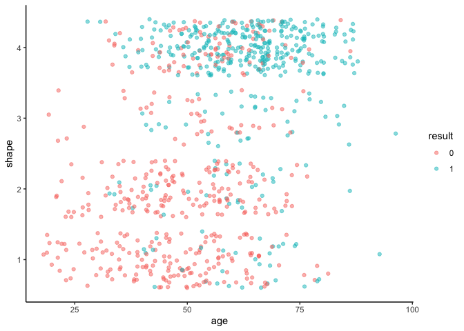
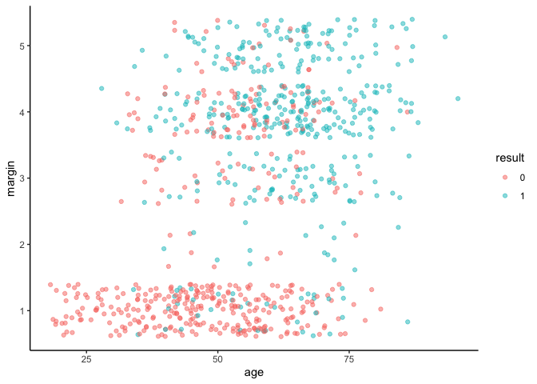
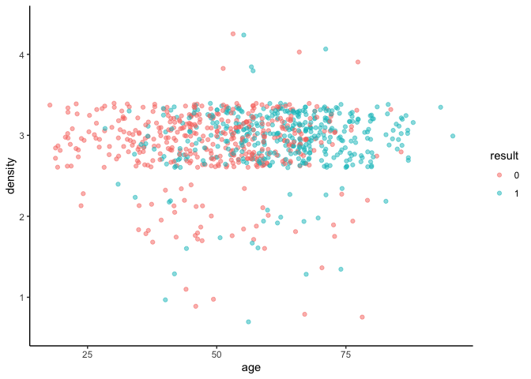

Mammographic Masses Classification via Neural Network
================
Rex Manglicmot

-   <a href="#status-continuing-working-document"
    id="toc-status-continuing-working-document">Status: Continuing Working
    Document</a>
-   <a href="#introduction" id="toc-introduction">Introduction</a>
-   <a href="#loading-the-libraries" id="toc-loading-the-libraries">Loading
    the Libraries</a>
-   <a href="#loading-the-data" id="toc-loading-the-data">Loading the
    Data</a>
-   <a href="#cleaning-the-data" id="toc-cleaning-the-data">Cleaning the
    Data</a>
-   <a href="#exploratory-data-analysis"
    id="toc-exploratory-data-analysis">Exploratory Data Analysis</a>
-   <a href="#artificial-neural-networks"
    id="toc-artificial-neural-networks">Artificial Neural Networks</a>
-   <a href="#limitations" id="toc-limitations">Limitations</a>
-   <a href="#conclusion" id="toc-conclusion">Conclusion</a>
-   <a href="#inspiration-for-this-project"
    id="toc-inspiration-for-this-project">Inspiration for this project</a>

## Status: Continuing Working Document

Hi everyone. I’m continuing building my data analysis and R skills. As
such, I would love feedback to better improve this project via
<rexmanglicmot@gmail.com>. Any mistakes and misrepresentation of the
data are my own. Things still need to do/questions:

-   more info on neural networks
-   flush out intro
-   get feedback on project
-   better visualization for the dataset?

## Introduction

<center>


</center>

Breast Cancer (BC) is a disease that warrants much attention because
according to the CDC, it is the most common cancer in women, with
incidence rates increasing 0.5% pervyear, and roughly 13% will develop
BC in their lifetime.[^1] According to Breastcancer.org, the overall
breast cancer deaths have declined to 43% from 1989-2020 due to
treatment advances and early detection.[^2] Nevertheless, about 42K
women and 500 men die per year.[^3] Therefore, there is a dire need for
prevention and early detection.

A BC tumor can be too small to be papalbale by a physician.[^4] Although
there are breast self-exams for detection of a lump, seeking medical
attention is the best route for validation. Therefore, a routine
mammogram can help with early detection in women. The common route to
detect involves a first a mammogram and then a biopsy of the breast in
which the physician removes a small amount of breast tissue and is
examined by a pathologist for tissue abnormalities akin to breast
cancer.[^5] This type of biopsy is also used to help physician determine
not only if the tissue is cancerous but also at what stage has the
cancer developed to. Results of the biopsy often take several days. But
according to the authors of the dataset, the

“*…the low positive predictive value of breast biopsy resulting from
mammogram interpretation leads to approximately 70% unnecessary biopsies
with benign outcomes.*”

So in hopes to diminish the amount of breast biopsies, researchers have
developed computer-aided diagnosis to assist physicians with their
decision to pursue a breast biospy or not by using the BI-RAD attributes
and a patient’s age.

The purpose of this project is to identify ways to predict BC through
classification of numeric features of the dataset. By doing this
research we are extrapolate the model to identify women who fit the
classification and propose steps to help decrease the likeliness of
incidence.

The model I will be using is Neural Networks.

This project is organized in the following chapters:

1.  Loading the Libraries
2.  Loading the Data
3.  Cleaning the Data
4.  Exploratory Data Analysis
5.  Neural Networks
6.  Limitations
7.  Conclusion
8.  Inspiration for this project

A special acknowledgement to the University of Irvine data repository
for making the dataset open to the public. A further special
acknowledgement to M. Elter, R. Schulz-Wendtland and T. Wittenberg for
their paper and providing the dataset.[^6] According to the authors, a
mammography (a type of x-ray that is used to detect the presence of
cancer[^7]) is the most effective way for BC screening. The dataset
contains features of a mammography.

The original dataset contains the following variables:

1.  BI-RADS assessment: 1 to 5 (ordinal, non-predictive!)
2.  Age: patient’s age in years (integer)
3.  Shape: mass shape: round=1 oval=2 lobular=3 irregular=4 (nominal)
4.  Margin: mass margin: circumscribed=1 microlobulated=2 obscured=3
    ill-defined=4 spiculated=5 (nominal)
5.  Density: mass density high=1 iso=2 low=3 fat-containing=4 (ordinal)
6.  Severity: benign=0 or malignant=1 (binominal, goal field!)

## Loading the Libraries

``` r
library(tidyverse)
library(viridis)
library(neuralnet)
```

## Loading the Data

``` r
#get data from UCI website
url <- 'https://archive.ics.uci.edu/ml/machine-learning-databases/mammographic-masses/mammographic_masses.data'

#load data into object
data_orig <- read.csv(url)
```

## Cleaning the Data

``` r
# look at data
str(data_orig)
```

    ## 'data.frame':    960 obs. of  6 variables:
    ##  $ X5  : chr  "4" "5" "4" "5" ...
    ##  $ X67 : chr  "43" "58" "28" "74" ...
    ##  $ X3  : chr  "1" "4" "1" "1" ...
    ##  $ X5.1: chr  "1" "5" "1" "5" ...
    ##  $ X3.1: chr  "?" "3" "3" "?" ...
    ##  $ X1  : int  1 1 0 1 0 0 0 1 1 1 ...

It would seem that the data is messy.

On the UCI website it listed that the there are a total of 961
observatins but we have only 960. Therefore, the column name would
appear to be an observation. However, upo further inspection, the “X5.1”
and “X3.1” column does not make any sense because values should be based
on 1-5 and 1-4, respectively. I will therefore delete that observation
from the dataset and relabel the columns.

But first, I will make a copy of the original dataset for manipulation.

``` r
#make a copy
data <- data_orig

#change column names
colnames(data) <- c('BIRAD', 'age', 'shape', 'margin', 'density', 'result')

#get rid of BIRAD since on the UCI website it is non-predictive
data <- subset(data, select = -(BIRAD))

#How many NA do we have?
sum(is.na(data))
```

    ## [1] 0

``` r
#how many columns have ?
sum(data == '?')
```

    ## [1] 160

``` r
# which specific observations have '?'
which(data == '?')
```

    ##   [1]  443  453  683  884  923  966  969  980 1008 1014 1034 1043 1088 1117 1123
    ##  [16] 1196 1215 1347 1348 1349 1354 1436 1456 1479 1491 1497 1514 1521 1541 1574
    ##  [31] 1620 1621 1622 1712 1738 1784 1925 1926 1927 1932 1939 1940 1942 1947 1955
    ##  [46] 1968 1979 2004 2005 2007 2014 2020 2021 2023 2053 2067 2076 2077 2079 2107
    ##  [61] 2147 2198 2218 2225 2235 2279 2291 2292 2307 2314 2372 2379 2396 2439 2440
    ##  [76] 2441 2451 2461 2494 2582 2611 2643 2665 2739 2881 2884 2899 2902 2906 2915
    ##  [91] 2918 2920 2923 2925 2927 2932 2933 2935 2937 2938 2939 2943 2945 2947 2954
    ## [106] 2964 2965 2967 2968 2972 2976 2977 2980 2981 2982 2983 2984 2985 2986 2987
    ## [121] 2989 2993 2994 2996 3001 3006 3007 3008 3013 3022 3024 3036 3038 3051 3056
    ## [136] 3064 3089 3092 3098 3142 3157 3165 3185 3219 3231 3251 3252 3255 3301 3340
    ## [151] 3344 3374 3381 3449 3454 3494 3507 3545 3557 3632

``` r
# which specific observations have '*'
sum(data == '*')
```

    ## [1] 0

``` r
#Replace ? with NAs
data[data == '?'] <- NA

#sum the NAs again
sum(is.na(data))
```

    ## [1] 160

``` r
#remove the NA observations
data <- na.omit(data)

#dimensions of the dataset
dim(data)
```

    ## [1] 830   5

Let’s change the class

``` r
#convert age column into a numeric
data$age <- as.numeric(as.character(data$age))

#create a list to convert remaining columns
index <- 2:ncol(data)

#pass list to function
data[ ,index] <- lapply(data[ ,index], as.factor)

#check structure again
str(data)
```

    ## 'data.frame':    830 obs. of  5 variables:
    ##  $ age    : num  58 28 57 76 42 36 60 54 52 59 ...
    ##  $ shape  : Factor w/ 4 levels "1","2","3","4": 4 1 1 1 2 3 2 1 3 2 ...
    ##  $ margin : Factor w/ 5 levels "1","2","3","4",..: 5 1 5 4 1 1 1 1 4 1 ...
    ##  $ density: Factor w/ 4 levels "1","2","3","4": 3 3 3 3 3 2 2 3 3 3 ...
    ##  $ result : Factor w/ 2 levels "0","1": 2 1 2 2 2 1 1 1 1 2 ...
    ##  - attr(*, "na.action")= 'omit' Named int [1:130] 1 4 5 6 7 9 12 19 20 22 ...
    ##   ..- attr(*, "names")= chr [1:130] "1" "4" "5" "6" ...

## Exploratory Data Analysis

``` r
#see the summary statistics
summary(data)
```

    ##       age        shape   margin  density result 
    ##  Min.   :18.00   1:190   1:320   1: 11   0:428  
    ##  1st Qu.:46.00   2:180   2: 23   2: 56   1:402  
    ##  Median :57.00   3: 80   3:106   3:755          
    ##  Mean   :55.76   4:380   4:255   4:  8          
    ##  3rd Qu.:66.00           5:126                  
    ##  Max.   :96.00

This is interesting. Here are some insights:

-   the age of the dataset ranges from 18 to 96 with a mean of 57.
-   shape variable has more of the 4 category than 1.
-   margin variable has more of the 4 category than 1.
-   density varaible has much more of the 3 cateogry than the others.
-   result variable seems to be about even.

``` r
#create a histogram of the ages overall
ggplot(data, aes(x=age)) +
  geom_histogram() +
  theme_classic()
```

    ## `stat_bin()` using `bins = 30`. Pick better value with `binwidth`.

<!-- -->

The shape of the distribution looks normal. Let’s break it apart into
result 0 and 1.

``` r
#create a histogram of the ages for 0 and 1
ggplot(data, aes(x= age, fill= result)) +
  geom_histogram(position = 'dodge',
                 color = 'black') +
  theme_classic() #+
```

    ## `stat_bin()` using `bins = 30`. Pick better value with `binwidth`.

<!-- -->

``` r
  # facet_wrap(~result) 
```

The distribution looks normal for both, but the means are obviously
different.

``` r
#let's look at shape
ggplot(data, aes(x=age, y=shape, color=result)) +
  geom_point(position = 'jitter', alpha = 0.5) +
  theme_classic()
```

<!-- -->

Interesting. There the ages we see that there is more of 0 in shape
categories 1 and 2 while there is more1 in shape category 4. I might
also add that there are few observations in shape category 3 for both 0
and 1.

``` r
#let's look at margin
ggplot(data, aes(x=age, y=margin, color=result)) +
  geom_point(position = 'jitter', alpha = 0.5) +
  theme_classic()
```

<!-- -->

``` r
#let's look at density
ggplot(data, aes(x=age, y=density, color=result)) +
  geom_point(position = 'jitter', alpha = 0.5) +
  theme_classic()
```

<!-- -->

## Artificial Neural Networks

Artificial Neural Networks is akin to the nervous system in that the
model uses several neurons through an interconnected pathway to detect
hidden patterns in complex datasets. ANN take in data and train to
recognize patterns and predict outputs.

Examples of ANN is facial recognition, forecasting, music composition,
etc. Tasks such as image recognition can take minutes compared to hours
when humans are invovled.[^8]

ANN comprised of:

-   an **input layer**: receives the input
-   a **hidden layer(s)**: consist of neurons and is between the input
    and output layer and performs most of the computations.
-   an **output layer**: predicts final output

<center>


</center>

On a much deeper level neurons consists of inputs, weights, bias,
activation function, and output. As IBM states, in the figure below,
each nueron has its own linear regression model and the output of the
model is defined as:[^9]

<center>

∑wixi + bias = w1x1 + w2x2 + w3x3 + bias

output = f(x) = 1 if ∑w1x1 + b\>= 0; 0 if ∑w1x1 + b \< 0
</center>

``` r
#convert the columns factors into an integer because factors can't be normalized
data2 <- as.data.frame(lapply(data,as.integer))

#check the class
lapply(data2, class)
```

    ## $age
    ## [1] "integer"
    ## 
    ## $shape
    ## [1] "integer"
    ## 
    ## $margin
    ## [1] "integer"
    ## 
    ## $density
    ## [1] "integer"
    ## 
    ## $result
    ## [1] "integer"

``` r
#normalize the dataset with a function
data_norm <- function (x) {
  ((x-min(x))/ (max(x)- min(x)))
}

#use lapply to normalize the data
data3 <- as.data.frame(lapply(data2, data_norm))

#check if all values are from 0 to 1
summary(data3)
```

    ##       age             shape            margin         density      
    ##  Min.   :0.0000   Min.   :0.0000   Min.   :0.000   Min.   :0.0000  
    ##  1st Qu.:0.3590   1st Qu.:0.3333   1st Qu.:0.000   1st Qu.:0.6667  
    ##  Median :0.5000   Median :0.6667   Median :0.500   Median :0.6667  
    ##  Mean   :0.4842   Mean   :0.5944   Mean   :0.453   Mean   :0.6386  
    ##  3rd Qu.:0.6154   3rd Qu.:1.0000   3rd Qu.:0.750   3rd Qu.:0.6667  
    ##  Max.   :1.0000   Max.   :1.0000   Max.   :1.000   Max.   :1.0000  
    ##      result      
    ##  Min.   :0.0000  
    ##  1st Qu.:0.0000  
    ##  Median :0.0000  
    ##  Mean   :0.4843  
    ##  3rd Qu.:1.0000  
    ##  Max.   :1.0000

``` r
#make results reproducible
set.seed(123)

#split the data into an 80 and 20 split
sample <- sample(2, nrow(data3), replace= TRUE, 
                 prob= c(0.8, 0.2))

#train and test set
train <- data3[sample==1, ]
test <- data3[sample==2, ]
```

``` r
#make results reproducible
set.seed(456)

#create a neural network from our train dataset
n <- neuralnet(result~., data= train,
               #1 layer for now 
               hidden = 1,
               err.fct = 'ce',
               linear.output = FALSE
               )

#plot the neural network
#need to add the "rep='best'" code, otherwise plot won't show up on Rmarkdown
plot(n, rep='best')
```

<!-- -->

4 inputs layer with 4 nodes and 1 output layer with 1 node. There is 1
hidden layer (as specified in our code) or neuron.

``` r
#Train data -- build confusion matrix
output <- compute(n, train[,-5])

#store net.result into output object and into another object
p1 <- output$net.result

#convert the probabilities into binary factor:
#1, if p1 > 0.5 or 0, if p1 < 0.5
pred1 <- ifelse(p1 > 0.5, 1, 0)

#build out confusion matrix into a table
table1 <- table(pred1, train$result)

#view table
print(table1)
```

    ##      
    ## pred1   0   1
    ##     0 271  54
    ##     1  77 261

Insights:

-   271 patients were correctly classified as 0
-   261 patients were correctly classified as 1

There are misclassifications.

``` r
#calculate missclassification error
1-sum(diag(table1))/sum(table1)
```

    ## [1] 0.1975867

``` r
#Note: sum(diag(table1))/sum(table1) by itself, it gives accuracy.
```

Misclassification error is 20%.

Repeat for test data.

``` r
#Test data -- build confusion matrix
output2 <- compute(n, test[,-5])

#store net.result into output object and into another object
p2 <- output2$net.result

#convert the probabilities into binary factor:
#1, if p1 > 0.5 or 0, if p1 < 0.5
pred2 <- ifelse(p2 > 0.5, 1, 0)

#build out confusion matrix into a table
table2 <- table(pred2, test$result)

#view table
print(table2)
```

    ##      
    ## pred2  0  1
    ##     0 67 19
    ##     1 13 68

Insights:

-   67 patients were correctly classified as 0
-   68 patients were correctly classified as 1

``` r
#calculate misclassification error
1-sum(diag(table2))/sum(table2)
```

    ## [1] 0.1916168

Misclassification error, again, is 20%.

Neural network is consistent with both the train and test datasets.

Let’s try with more hidden layers.

``` r
#let's arbitrarily try 4 due to number of inputs
#create a neural network from our train dataset
n2 <- neuralnet(result~., data= train,
               #4 layer for now 
               hidden = 4,
               err.fct = 'ce',
               linear.output = FALSE
               )

#plot the neural network
plot(n2, rep='best')
```

<!-- -->

## Limitations

## Conclusion

## Inspiration for this project

Inspiration for this project is history of breast cancer within my
family.

[^1]: <https://www.cancer.org/cancer/breast-cancer/about/how-common-is-breast-cancer.html>

[^2]: <https://www.breastcancer.org/facts-statistics>

[^3]: <https://www.cdc.gov/cancer/breast/basic_info/index.htm#>:\~:text=Each%20year%20in%20the%20United,breast%20cancer%20than%20White%20women.

[^4]: <http://www.idph.state.il.us/about/womenshealth/factsheets/breast_cancer_facts.htm#>:\~:text=Breast%20cancer%20often%20starts%20out,problems%20and%20can%20cause%20death.

[^5]: <https://www.mdanderson.org/cancerwise/8-breast-biopsy-questions-answered.h00-159303834.html>

[^6]: M. Elter, R. Schulz-Wendtland and T. Wittenberg (2007) The
    prediction of breast cancer biopsy outcomes using two CAD approaches
    that both emphasize an intelligible decision process. Medical
    Physics 34(11), pp. 4164-4172

[^7]: <https://www.radiologyinfo.org/en/info/mammo>

[^8]: <https://www.ibm.com/topics/neural-networks>

[^9]: <https://www.ibm.com/topics/neural-networks>
